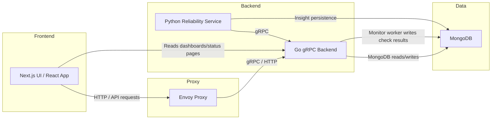
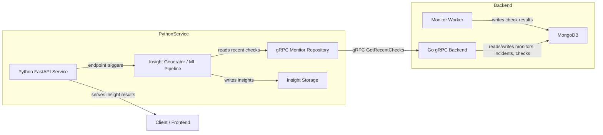

# Upstat Architecture

## Overview
This diagram describes the main components of Upstat and how they interact.

## Components

- **Frontend**: Next.js / React application in `web` and `App`.
- **Envoy**: Proxy layer in `deploy/envoy/envoy.yaml` and Docker Compose.
- **Go Backend**: gRPC server in `api/common`, exposing `MonitorService` and `UserService`.
- **Python Reliability Service**: FastAPI service in `reliability-service`, calling Go backend via gRPC to analyze recent monitor checks.
- **MongoDB**: Primary database for monitors, check results, incidents, and insights.

## Communication patterns

- `UI -> Envoy -> GoBackend`: frontend requests route through Envoy.
- `PythonService -> GoBackend`: gRPC client calls using shared proto definitions in `api/common/proto/user.proto`.
- `GoBackend -> Mongo`: persistence for monitors, checks, incidents.
- `PythonService -> Mongo`: insight persistence.

## Notes

- The system is distributed: services run in separate containers/processes and communicate over network protocols.
- The project currently uses Docker Compose for local orchestration.
- The Go backend contains an internal monitor worker that schedules periodic checks.

## Backend + Python Reliability Service Details

### Go backend 

1. The Go service starts in `api/common/main.go`, initializing the MongoDB connection and registering the gRPC `MonitorService` and `UserService` handlers.
2. The gRPC API is defined in `api/common/proto/user.proto` and includes `GetRecentChecks`, `GetStatusPage`, and monitor CRUD operations.
3. The internal monitor worker in `api/common/services/monitor_worker.service.go` wakes periodically, loads active monitors, and executes checks concurrently.
4. Check execution is done in `api/common/services/checker.service.go`, which performs the HTTP request, measures response time, and assembles a check result.
5. Check results are persisted through `api/common/repositories/check_result.repositories.go`.
6. Incidents and monitor state are updated through the corresponding repository methods in `api/common/repositories/incident.repositories.go` and `api/common/repositories/monitor.repositories.go`.

### Python reliability service 

1. The Python service starts in `reliability-service/main.py` and loads env vars from `reliability-service/.env`.
2. Its FastAPI routes are defined in `reliability-service/api/insights.py` and `reliability-service/api/analyze.py`.
3. `GET /insights/{monitor_id}` and `POST /analyze/{monitor_id}` both call `generate_insight(monitor_id)` in `reliability-service/services/insight_generator.py`.
4. That generator calls `reliability-service/repositories/monitor_repository.py`, which opens a gRPC connection to the Go backend and calls `GetRecentChecks`.
5. The gRPC response is converted into local `MonitorCheck` objects.
6. Feature extraction is performed by `reliability-service/ml/feature_builder.py`, producing metrics such as failed checks, total checks, and average response time.
7. Risk scoring and anomaly classification are performed by `reliability-service/services/risk_scorer.py`, `services/severity_classifier.py`, and `services/anomaly_detector.py`.
8. Human-readable signals are generated by `reliability-service/analysis/failure_analysis.py`, `latency_analysis.py`, and `trend_analysis.py`.
9. The final `Insight` object is saved through `reliability-service/repositories/insight_repository.py` and returned to the caller.

### Why this is useful

- The Go backend owns monitor state and check execution, making it the authoritative source for recent monitor health.
- The Python service owns analytics and machine learning, consuming the Go service via a clear gRPC interface.
- The system separates operational monitoring from analysis, which is the key architectural boundary.
